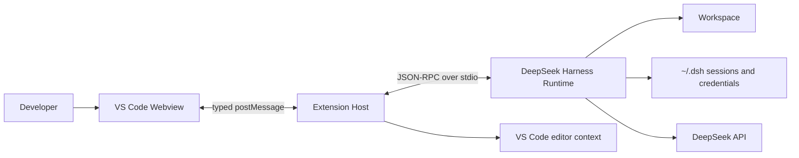
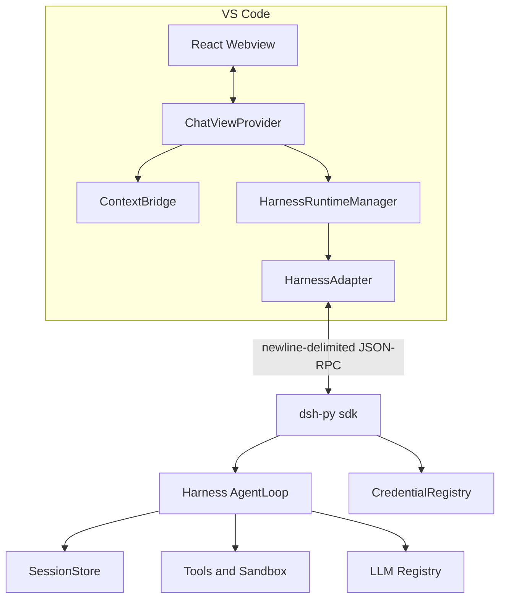
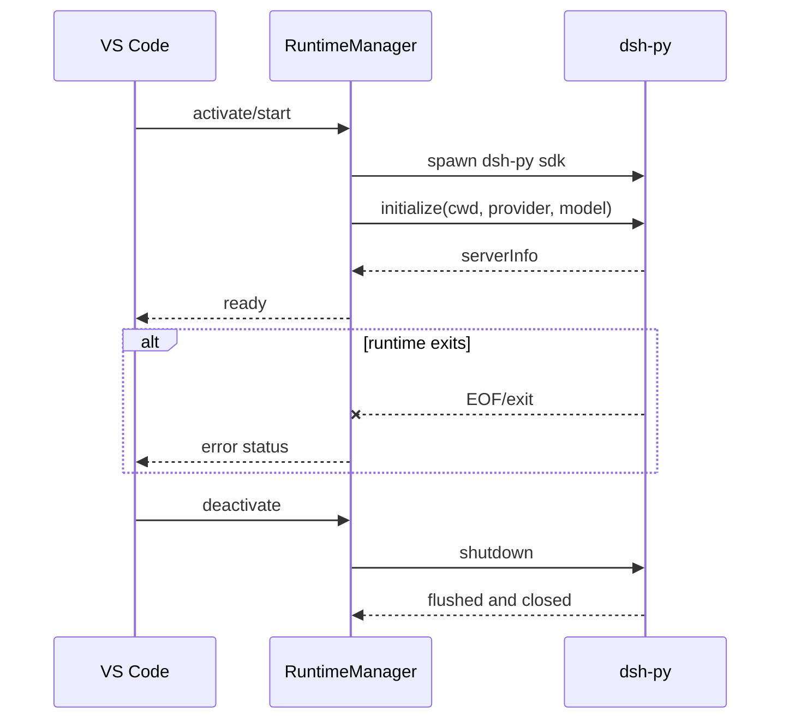
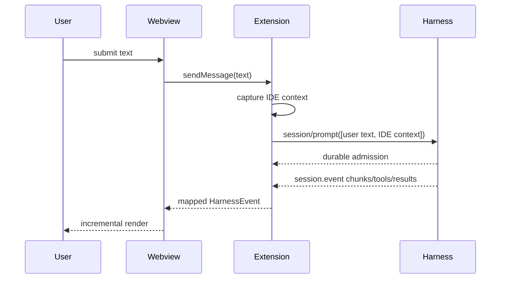
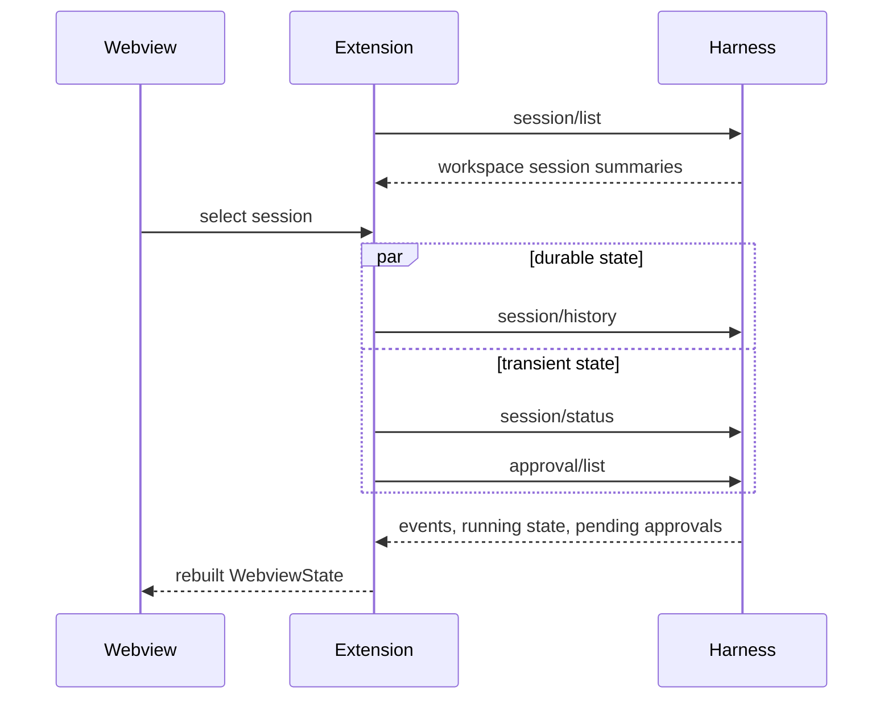
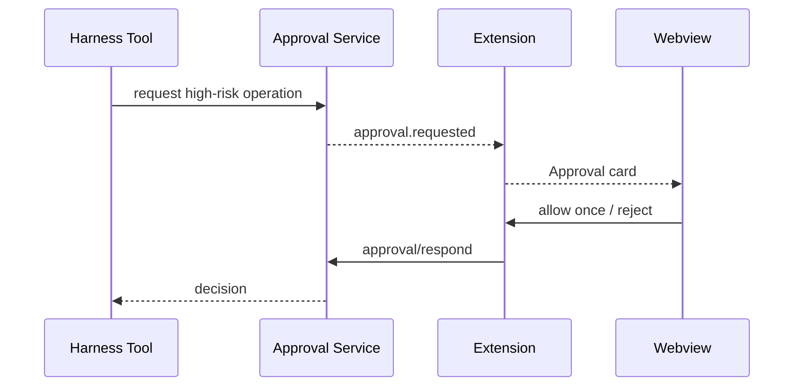

# Architecture

## System goal

DeepSeek Harness VS Code is an IDE client for the existing Harness agent runtime. It delivers a compact Harness Web experience in the VS Code sidebar without moving the agent loop, tools, sandbox, model access, credentials, or persistence into the Extension Host.

The first release target is macOS Apple Silicon.

## System context

## Container architecture

## Module architecture

- `src/runtime`: process lifecycle, status, restart serialization, runtime environment.
- `src/harness`: stable adapter, JSON-RPC client, native event mapping.
- `src/context`: read-only collection of editor, selection, diagnostics, Git, and explicit attachments.
- `src/views`: VS Code/Webview orchestration, session presentation state, approval and settings intents.
- `src/webview`: React-only presentation and user intents.
- `src/shared`: closed message and event unions shared across the Webview boundary.

## Runtime lifecycle

Starts are generation-scoped. A stop or restart invalidates an older start so a late child cannot overwrite the active runtime. Runtime errors are retained and published to the Webview.

## Message and context flow

The visible user text is the first content block. IDE context is a separate tagged text block so it is available to the model but hidden from the user-message bubble. Current file content is not automatically copied; Harness tools can read it. Explicit attachments and selections include content with bounded sizes.

## Session lifecycle and resume

Harness persistence is authoritative. VS Code global state is only a last-selected presentation cache. Web and VS Code sessions are discoverable from the same `~/.dsh` repository when their workspace path matches.

## Tool approval flow

Pending approvals are queryable. Switching sessions or rebuilding the Webview therefore cannot permanently lose an answerable request.

## Settings and credential flow

The settings page reads provider/model from VS Code configuration and credential status from Harness. A submitted key crosses the Webview and JSON-RPC boundaries once, is stored by `CredentialRegistry`, and is never returned. Provider/model changes restart the runtime; credential changes also restart to guarantee that every adapter reloads the new value.

## Failure handling

- Spawn errors, protocol errors, timeouts, malformed frames, and child exits become runtime error status.
- Runtime failure does not throw through VS Code activation.
- Session activation is generation-scoped to prevent rapid selection races.
- History plus pending-approval and status queries recover transient UI state.
- Presentation history is bounded; Harness retains the authoritative complete log.

## Security boundary

- Webview: presentation and typed intents only.
- Extension Host: VS Code API, read-only context capture, child lifecycle; no model-authored command execution.
- Harness Runtime: tools, filesystem mutation, shell execution, sandbox, approvals, credentials, and session persistence.
- API keys never enter chat events, extension persistence, or logs.
